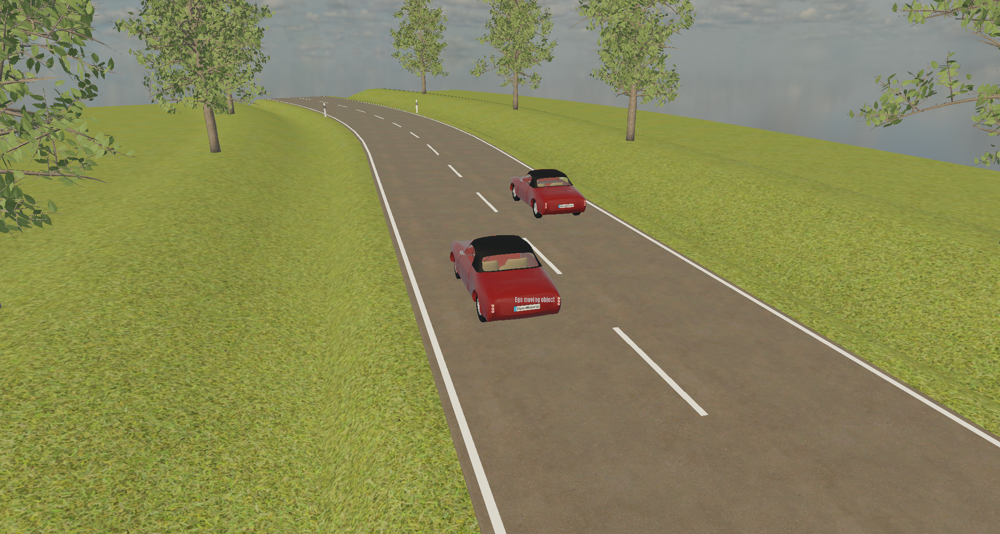

# Scenario example

This example showcases the interaction between ASAM OpenMATERIAL 3D, ASAM OpenDRIVE, ASAM OpenSCENARIO and ASAM OSI.

## ASAM OpenDRIVE

The `environment_example.xodr` is an OpenDRIVE file, that corresponds to the environment_example OpenMATERIAL 3D asset, also contained in the exmaples folder.
This means, that the environment example asset has the same coordinate frame as the corresponding OpenDRIVE file.
Furthermore, the road network geometry in the asset corresponds to the road network description of the OpenDRIVE.

## ASAM OpenSCENARIO

The `scenario_example_two_vehicles.xosc` is an OpenSCENARIO file.
It links the OpenDRIVE file described above as `LogicFile`.
It also links the corresponding OpenMATERIAL 3D asset as `SceneGraphFile`, so it can be associated with the stationary environment.
The moving entities are described in a separate vehicle catalog, which can be found in `catalogs/vehicles/VehicleCatalog.xosc`.
It contains one vehicle, that refers to the OpenMATERIAL 3D vehicle_example as `model3d`.

## ASAM OSI

To showcase the interaction with OSI, the OpenSCENARIO described above was played with the scenario player [esmini](https://github.com/esmini/esmini).
The output was stored in an ASAM OSI binary SensorView trace file, `20250130T100644Z_sv_370_2112_700_scenario_example_two_vehicles.osi`.
The OpenMATERIAL 3D assets linked in the OpenSCENARIO file and the OpenSCENARIO vehicle catalog are contained in the OSI trace file as model_references.
The screenshot below was taken with Persival Simspector to visualize the content of the OSI trace file including the referenced OpenMATERIAL 3D assets.

